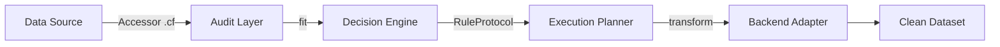

<div align="center">

# Cleanframe: The Hardware-Optimized Data Intelligence Framework

[](https://pypi.org/project/cleanframe/)
[](https://www.python.org/downloads/)
[](https://github.com/vahe-gdlyan/cleanframe)
[](https://opensource.org/licenses/MIT)
[](https://pandas.pydata.org/)
[](https://pola.rs/)
[](https://duckdb.org/)

Cleanframe empowers engineers to operate beyond hardware memory limitations by bringing intelligent, out-of-core data cleaning to highly constrained environments. Built on a "do no harm" philosophy, it guarantees complete explainability and developer control over every transformation.

</div>

---

## 🛑 The Problem

If you work in data science or machine learning, you have lived this reality:

- **RAM Exhaustion:** Datasets that simply exceed your machine's memory, causing `MemoryError` exceptions.
- **Notebook Spaghetti:** Jupyter notebooks filled with repetitive, unmaintainable cleaning code.
- **Silent Failures:** Hidden target leakage that artificially inflates model performance.
- **Inconsistent Pipelines:** Ad-hoc scripts that mutate data implicitly without an audit trail.
- **Manual Validation:** Hours wasted manually validating cross-column relationships and fuzzy duplicates.

You've experienced this. Existing workflows are painful because they force a choice between safe auditing and fast execution. 

---

## 👁️ Why Cleanframe Exists

Cleanframe was engineered to solve the disconnect between big data requirements and constrained hardware reality (e.g., 2011-era i3 CPUs and 8GB RAM systems). 

We believe that data cleaning should not be a black box. Cleanframe exists to provide **intelligent audits**, **explainable decisions**, and **human-in-the-loop workflows**. By introducing a hardware-aware execution model, it guarantees reproducibility and strict backend continuity without sacrificing developer experience. 

---

## 📐 Core Design Principles

1. **Do No Harm:** By default, rules act solely as auditors. Cleanframe will never mutate your data implicitly. Explicit mutation (e.g., `action="drop"`) must be provided.
2. **Explain Every Decision:** Every detected anomaly and transformation is logged via a zero-dependency, structured telemetry matrix. 
3. **Human Approval Before Execution:** Our generator-based architecture separates `.fit()` (audit) from `.transform()` (execution), allowing developers to review recommendations before committing to changes.
4. **Hardware-Aware Processing:** From Vitter's Algorithm R for $O(k)$ memory profiling to database-level RAM hard-caps, the framework respects your hardware limits.
5. **Reproducibility First:** Production pipelines are defined via declarative TOML configuration layers, ensuring exact reproducibility across environments.

---

## ⚡ Why Cleanframe?

### 🦆 Out-of-Core Execution
**DuckDB Integration:** Cleanframe natively processes multi-gigabyte Parquet and CSV files directly from disk. Using the `DuckDBBackend`, the framework executes `PRAGMA memory_limit = '4GB'` to hard-cap RAM consumption at the database level, pushing complex transformations down into lazy SQL CTEs and entirely bypassing Python memory limits.

### 🔄 Backend-Agnostic Processing
**Narwhals / Pandas / Polars Compatibility:** The `.cf` accessor natively supports both Pandas and Polars DataFrames without code duplication. Using `typing.Generic[FrameT]`, Cleanframe preserves your exact DataFrame type through the pipeline—meaning zero type degradation and 100% strict `mypy` coverage.

### 🛡️ Do-No-Harm Intelligence
**Leakage Detection & Safe Transformations:** Cleanframe ships with advanced rules like `CrossColumnConsistencyRule` (relational constraint validation), `TargetLeakage` checks, and `NearDuplicateDetector` (MinHash-LSH). They detect anomalies and warn you by default. You retain complete control.

---

## 📦 Installation

Install the core framework for Pandas and Polars:

```bash
pip install cleanframe
```

Install with out-of-core execution support:

```bash
pip install cleanframe[duckdb]
```

---

## ⏱️ 60-Second Quick Start

Cleanframe injects its API directly into your DataFrames via the `.cf` accessor. 

```python
import polars as pl
import cleanframe

# 1. Load your DataFrame
df = pl.DataFrame({
    "user_id": [1, 2, 2, 3],
    "status": ["ACTIVE", "active", "PENDING", "ACTIVE"],
    "age": [25, 25, 999, 30]
})

# 2. Audit the data (Do No Harm)
report = df.cf.audit()
print(report.summary())

# 3. Apply authorized cleaning decisions
clean_df = df.cf.clean()
```

---

## 📊 Example Output

Cleanframe generates professional, highly readable audit reports designed for engineers:

```text
========================================================================
CLEANFRAME AUDIT REPORT
========================================================================
Run ID: 550e8400-e29b-41d4-a716-446655440000
Timestamp: 2026-06-24T12:00:00Z
------------------------------------------------------------------------
[WARN] TargetLeakage: Potential leakage detected in column 'status_code'.
       Signal Score: 0.98. Recommendation: Drop feature before modeling.

[INFO] FuzzyUnification: Detected 2 variations of 'ACTIVE' in 'status'.
       Action: Canonicalizing to 'ACTIVE' (pre_lowercase=True applied).

[WARN] CrossColumnConsistency: 1 row violates business constraint (age < 120).
       Action: Rule configured with action="drop". Row scheduled for deletion.

[INFO] NearDuplicateDetector: MinHash-LSH detected 1 near-duplicate record.
       Similarity Threshold: 0.85. Action: Tagged as duplicate.
========================================================================
```

---

## 🛠️ Advanced Feature Showcase

### Enforcing Relational Constraints

```python
from cleanframe.rules import CrossColumnConsistencyRule, ConsistencyConstraint

# Explicitly command the framework to drop violating rows
rule = CrossColumnConsistencyRule(
    constraints=[
        ConsistencyConstraint(condition="col('age') < 120", action="drop")
    ]
)
```

### Out-of-Core DuckDB Streaming

```python
from cleanframe.pipeline import DataCleaner
from cleanframe.backends import DuckDBBackend

# Process massive files directly from disk with a hard memory cap
backend = DuckDBBackend(memory_limit="4GB")
cleaner = DataCleaner(backend=backend)

# Streams data, processes via lazy CTEs, and writes output
cleaner.fit_transform("s3://massive-bucket/raw_data.parquet")
```

### Zero-Dependency Telemetry Sinks

```python
from cleanframe.telemetry import LocalJsonLinesSink

# Route structured metrics to JSON-Lines for external log aggregators
cleaner.add_sink(LocalJsonLinesSink(filepath="audit_trail.jsonl"))
```

---

## 🏗️ Architecture Overview



- **Data Source:** Raw Pandas/Polars DataFrames or Parquet/CSV files.
- **Audit Layer:** Evaluates data using Vitter's Algorithm R for exact, low-memory reservoir profiling.
- **Decision Engine:** Translates findings into `Decision` dataclasses via zero-configuration plugins.
- **Execution Planner:** Safely organizes transformations, respecting `action="drop"` and other mutation flags.
- **Backend Adapter:** Maps logic seamlessly to Narwhals for in-memory frames or DuckDB for out-of-core execution.
- **Clean Dataset:** Returns a dataset preserving the exact upstream type `Generic[FrameT]`.

---

## 🎯 Who Is It For?

### Ideal For
* Data Scientists working on constrained local hardware
* ML Engineers who need to prevent target leakage in production
* Analytics Engineers building reproducible pipelines
* Researchers demanding 100% explainable transformations
* Data Teams handling large datasets requiring out-of-core processing

### Probably Not For
* Users needing only basic CSV cleaning
* Workloads already easily solved by a few simple Pandas operations

---

## 🗺️ Roadmap

**Implemented (Phase 1-6)**
- ✅ Backend-agnostic `.cf` accessor via Narwhals
- ✅ Strict typing and structural subtyping (`RuleProtocol`)
- ✅ Memory-bounded Reservoir Profiling ($O(k)$ space)
- ✅ DuckDB out-of-core file streaming engine
- ✅ Declarative TOML configuration layer
- ✅ Zero-dependency structured JSON-L telemetry
- ✅ Intelligent rules (Fuzzy Unification, MinHash-LSH, KNN Imputer)

**Planned**
- ⏳ Expansion of the `importlib.metadata` entry point plugin ecosystem
- ⏳ Distributed computing adapters for cloud-scale execution

---

## 🤝 Contributing

Cleanframe thrives on community input. We welcome:
- **Bug Reports:** Open an issue if you discover edge cases in the backends.
- **Rule Contributions:** Have a robust data cleaning heuristic? Implement the `RuleProtocol` and submit a PR.
- **Backend Integrations:** Help us expand beyond DuckDB/Narwhals.
- **Documentation Improvements:** Enhancements to our guides and docstrings.

Please read our contributing guidelines before submitting a Pull Request.

---

## 📬 Connect With The Architect

**Vahe Gdlyan**

* LinkedIn: [https://www.linkedin.com/in/vahe-gdlyan-1415873a7/](https://www.linkedin.com/in/vahe-gdlyan-1415873a7/)
* Medium (UnderTheHood): [https://medium.com/@gdlyanvahe31](https://medium.com/@gdlyanvahe31)
